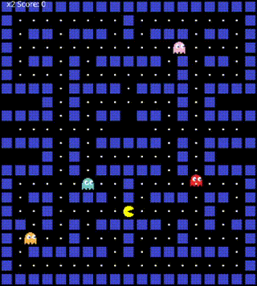

# PacMan

This is a simple PacMan game built using Java, for learning purposes.
Cherry or Loop are not implemented.

## Features

- **Game**: PacMan

## Demo

## Technology Used

- [Java]([https://www.javascript.com/](https://www.java.com/en/download/help/whatis_java.html)) - Language

[^1]: Referenced from YouTube channel @javascriptmastery
